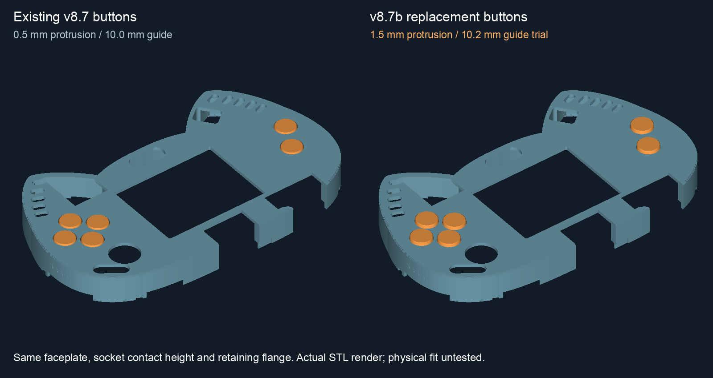
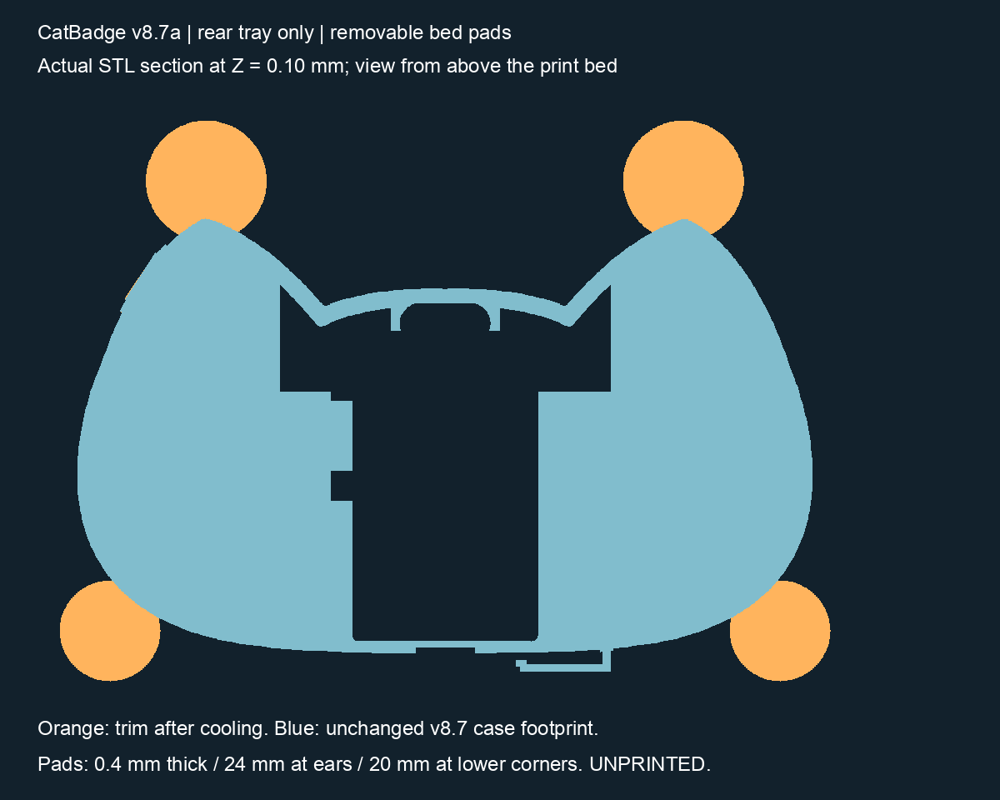

# CatBadge case

A printable enclosure for the **large Retia CatBadge / ScriptKitty badge**, with screwless case catches, an independently removable battery cover, and six flanged buttons.

**Latest files: v8.7 case, v8.7a rear adhesion pads, and v8.7b taller buttons.** These are prototypes. Digital checks pass; printed fit, snap force, adhesion improvement and durability remain unverified.

**[Download the latest release](https://github.com/netmana808/catbadge/releases/tag/v8.7b)** · [Assembly guide](work/v8_7/README.md) · [Printing notes](PRINTING.md)



## Choose what to print

| What you need | Files | Notes |
| --- | --- | --- |
| Complete closed-back case | [v8.7 combined 3MF](work/v8_7/CatBadge-v8.7-COMBINED-CLOSED-BACK.3mf) | Front, rear, cover and original-height buttons; spring-antenna access retained. |
| Rear with extra bed attachment | [v8.7a rear-only 3MF](work/v8_7a/parts/CatBadge-v8.7a-Rear-Tray-Adhesion-Tabs.3mf) | Four removable pads; reuse the v8.7 front and cover. |
| Taller buttons for the same front | [v8.7b six-button set](work/v8_7b/CatBadge-v8.7b-SIX-cap_G10p2_S3p2_PLUS1mm.3mf) | Provisional 10.2 mm guide / 3.2 mm socket; test first. |
| Case snap test | [v8.7 snap coupons](work/v8_7/PRINT_FIRST_v8.7_Snap_Only.3mf) | Compare retention before printing a complete case. |
| Button fit comparison | [v8.7b six fit trials](work/v8_7b/PRINT_FIRST_v8.7b_Button_Fit_Trials.3mf) | Guide and socket sizes are separate choices. [Identification map](work/v8_7b/preview/fit-trial-layout.png). |
| Pad-removal test | [v8.7a ear-tip coupon](work/v8_7a/tests/PRINT_FIRST_v8.7a_Ear_Pad_Removal.3mf) | Tests contact and trimming, not full-case warping. |

**For the newest combination**, use a [v8.7 front](work/v8_7/parts/faceplate.3mf), [v8.7 battery cover](work/v8_7/parts/battery_cover.3mf), v8.7a rear and your selected v8.7b buttons. The v8.7 combined file retains its original rear and buttons; it does not automatically include the later replacements.

The [NO-SPRING-ONLY front](work/v8_7/parts/faceplate_NO_SPRING_ONLY.3mf) and [matching combined kit](work/v8_7/CatBadge-v8.7-COMBINED-CLOSED-BACK-NO-SPRING-ONLY.3mf) require the original spring antenna to be absent. Both front variants retain SAO access.

All STL/3MF dimensions are millimeters. The 3MFs contain geometry only, without a printer profile or G-code. Use release assets for direct downloads, or GitHub's raw/download button for individual files.

## What's new

### v8.7 — closed rear and reinforced joint

- Closes the rear vents and large rear-ear windows while retaining battery and service access.
- Increases the rear floor from 1.6 to 2.4 mm, outward from the board.
- Widens four catches to 8 mm and thickens the mating tongue to 1.4 mm.
- Uses 0.35 mm nominal engagement, with 0.25 / 0.35 / 0.45 mm coupons.
- Moves the battery-cover interface outward 0.8 mm to match the thicker rear.

The screen opening remains **52.5 × 40 mm**, with LED slots, open SAO access, and the antenna connector in the rear tray's outer ear slope. Main shell depth is approximately **23.2 mm**, or **31.5 mm over the battery cover**. Loaded-holder design envelope: **15.7 × 32.7 × 59.7 mm**. Actual adapter body, cable bends and complete electronics clearances need a fit check.

### v8.7a — removable rear adhesion pads

Two **24 mm diameter** ear-tip pads and two **20 mm** lower-corner pads increase first-layer contact. They are **0.4 mm thick** and should be trimmed flush after cooling. Print envelope: **154 × 112 mm** before a brim. The case interfaces match v8.7 within export precision.

This responds to a report of both rear ears lifting during a PETG print. The failed file and settings were not confirmed, so the pads are a trial rather than a proven cure. [Rear reprint guide](work/v8_7a/README.md).



### v8.7b — taller button fit trials

- Adds **1 mm** to the exposed end: nominal protrusion increases from **0.5 to 1.5 mm**.
- Offers **10.0 / 10.2 / 10.3 mm** guides in the existing 10.6 mm opening.
- Retains socket contact height, 1.5 mm socket depth, 4.8 mm boss and 11.4 mm retaining flange.
- Includes **3.0 / 3.1 / 3.2 / 3.3 mm** socket trials and six-button sets for the provided combinations.

A closer guide is intended to reduce side play but must still move freely. Flanges stop outward escape; buttons can still fall out through the rear of a removed front. [Button selection guide](work/v8_7b/README.md).

## Printing and assembly

1. Start with the relevant fit coupons and inspect the sliced paths.
2. Keep the supplied orientations: **front and buttons face down; rear and cover exterior down**. Button sockets face up. The parts are designed for printing without supports at 0.20 mm layers; check your slicing result.
3. Print the padded rear separately, centered on the bed, with a connected brim. Let it cool before trimming while supporting the ears.
4. Check the empty case before installing electronics. With power removed, test free button sliding and gentle socket fit. Every button must release; no switch should be held down at rest.
5. Keep the matched v8.7 interfaces. V8.7a and v8.7b replace only their named parts; compatibility with older complete cases is not established.

See [PRINTING.md](PRINTING.md) for the proposed PETG starting trial. No script starts a printer job.

## Source and rebuild

Source is Python geometry code using NumPy, Shapely and Trimesh/Manifold. The full-case pipeline also uses OpenSCAD; VTK/Pillow render previews. This is not a native STEP model.

Use Python 3.12 and install OpenSCAD separately for full-case builds:

```sh
python3.12 -m venv .venv
.venv/bin/python -m pip install -r work/v8_7/requirements-resolved.txt
bash rebuild.sh v8.7b   # Buttons, checks and preview
bash rebuild.sh v8.7a   # Padded rear, coupon and checks
bash rebuild.sh v8.7    # Full case, coupons, checks and previews
```

`bash rebuild.sh all` runs all three. `v8.4` remains available for the original public release. The root script detects OpenSCAD on PATH or in `/Applications/OpenSCAD.app`; use `OPENSCAD_BIN=/path/to/OpenSCAD` for a custom executable and `CATBADGE_PYTHON` for an existing Python environment.

To check supplied case files without regenerating them:

```sh
.venv/bin/python work/v8_7/source/validate_v87.py --standalone
.venv/bin/python work/v8_7/source/check_overhangs.py
```

The root `rebuild.sh` is the public entry point. Historical local-workspace scripts are retained as provenance; some require unpublished baseline inputs. Standalone validation skips only unavailable historical-input checks and still checks supplied meshes and mechanical interfaces. The v8.7a/v8.7b builders include their reference meshes and validation.

## Validation and history

| Version | Digital checks | Physical status |
| --- | --- | --- |
| [v8.7](work/v8_7/validation.json) | 20 printable solids; formats, layout, snap/cover/button clearances; [layer support checks](work/v8_7/overhangs.json) | Complete fit, strength and snap feel unverified |
| [v8.7a](work/v8_7a/validation.json) | Single-solid rear/coupon; preserved case interfaces; additions confined to bed pads within export tolerance | Adhesion improvement and removal untested |
| [v8.7b](work/v8_7b/validation.json) | Six variants; 648 free-motion and 72 flange-stop checks; retained socket interfaces | Sliding fit, socket grip and switch return untested |

These checks do not establish manufacturing tolerances or allowable switch stroke. Only the original v0.1 tray/open frame has explicit user-confirmed fit. Release assets include source, validation, previews and SHA-256 checksums. The [v8.4 release](https://github.com/netmana808/catbadge/releases/tag/v8.4) remains available.

## Attribution

Independent enclosure for [RetiaLLC/DefconBadge2026](https://github.com/RetiaLLC/DefconBadge2026), not an official Retia product. PCB geometry and component-source credit belong to the badge designers. See [ATTRIBUTION.md](ATTRIBUTION.md).
