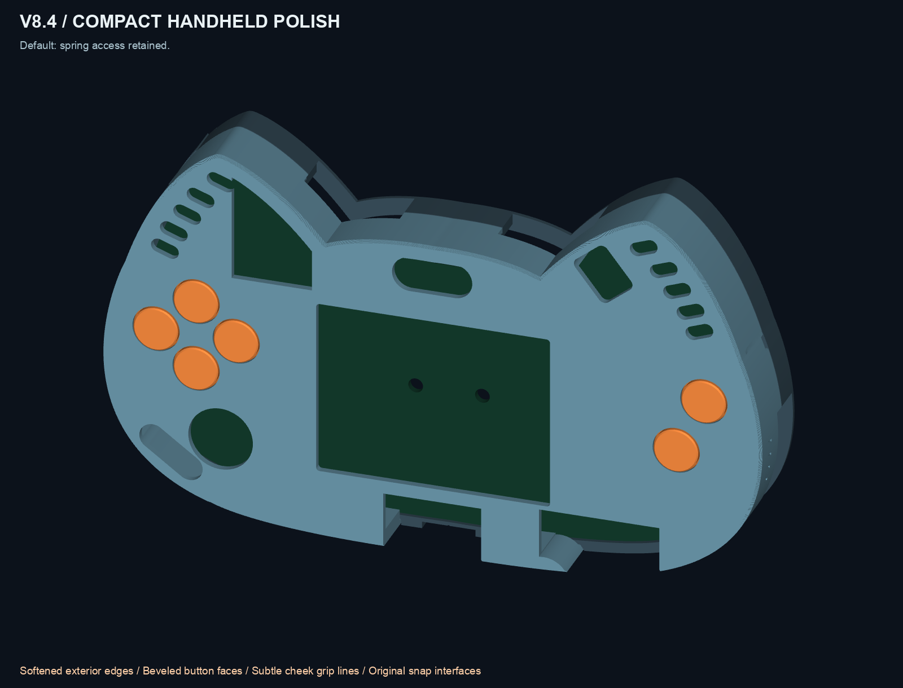
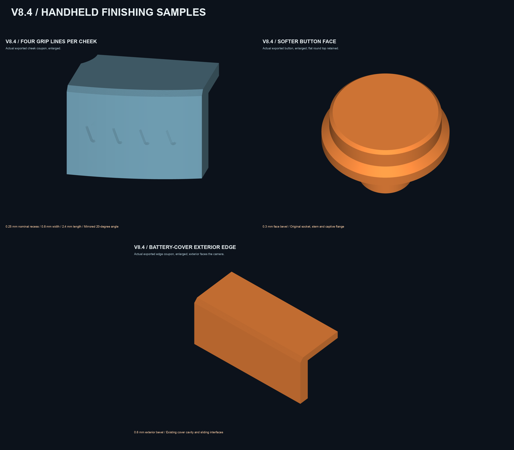

# CatBadge case

A printable, screwless enclosure for the **large Retia CatBadge / ScriptKitty badge**, with a removable battery cover and six individual button caps.

**Current design: v8.4, an unprinted PLA+ prototype.** Mesh, clearance, motion and overhang checks pass; physical fit, snap force and durability remain unverified. Only the original v0.1 tray/open frame has user-confirmed fit.



## Download and print

Use the [v8.4 release](https://github.com/netmana808/catbadge/releases/tag/v8.4) for the complete ZIP, combined 3MFs, test coupons and SHA-256 checksums. These are geometry-only files in millimeters, without a printer profile or G-code.

- **[Print-first fit and comfort coupons](work/v8_4/PRINT_FIRST_v8.4_Fit_and_Comfort.3mf)**: test the snap engagement, button sockets, screen opening and finishing before printing a complete enclosure.
- [Quick three-piece comfort set](work/v8_4/PRINT_FIRST_v8.4_Comfort_Only.3mf): cheek grip, battery-cover edge and one cap.
- **[Default combined case](work/v8_4/CatBadge-v8.4-COMBINED-HANDHELD.3mf)**: faceplate, rear tray, battery cover and six caps; original spring-antenna access retained.
- [Closed-ear combined variant](work/v8_4/CatBadge-v8.4-COMBINED-HANDHELD-NO-SPRING-ONLY.3mf): use only if the original spring antenna is absent. SAO access remains open.
- [Individual parts](work/v8_4/parts), [test pieces](work/v8_4/tests), and the **[assembly and fit guide](work/v8_4/README.md)**.

Keep the supplied print orientations. Start with coupons and check the empty case before fitting electronics. Button sockets and the antenna port remain trial dimensions.

## Design

- Four integral rim catches; no case screws or separate printed pins.
- Independent sliding battery cover with a guarded thumb latch.
- Six flanged button caps with 0.3 mm face bevels.
- 0.6 mm exterior edge bevels and four shallow grip lines per cheek.
- 52.5 × 40 mm screen opening, ten LED slots and open SAO access.
- Antenna port in the rear tray's outer left-ear slope, using the adapter's real metal retaining nut.

The shell is approximately **147.96 mm wide and 22.4 mm deep**, or 30.7 mm over the battery cover (31.2 mm including button faces). The measured loaded battery holder is **15.7 × 32.7 × 59.7 mm**. V8.3 mating interfaces are preserved and checked digitally; physical interchangeability still needs testing.



## Source and rebuild

The editable source is [Python geometry code](work/v8_4/source), using NumPy, Shapely, Trimesh/Manifold and OpenSCAD; VTK/Pillow generate previews from exported meshes. This is not a native STEP model.

Use Python 3.12 and install OpenSCAD separately. Then:

```sh
python3.12 -m venv .venv
.venv/bin/python -m pip install -r work/v8_4/requirements-resolved.txt
# Make the OpenSCAD CLI available on PATH, then:
bash rebuild.sh
```

On macOS, `rebuild.sh` also detects `/Applications/OpenSCAD.app`. A custom installation can be selected with `OPENSCAD_BIN=/path/to/OpenSCAD bash rebuild.sh`. No system tools are installed by this script.

To validate the downloaded files without rebuilding:

```sh
.venv/bin/python work/v8_4/source/validate_v84.py --standalone
.venv/bin/python work/v8_4/source/check_overhangs.py
```

The root `rebuild.sh` is the entry point for this public checkout. The versioned `run.sh` and `package_v84.py` preserve the original local-workspace workflow and check earlier, unpublished baseline directories; they are retained as provenance, not used here. `--standalone` skips only those unavailable local-input hash checks and still runs the geometry and mechanical checks.

## Validation and provenance

[Validation](work/v8_4/validation.json) covers 19 unique printable solids, STL/3MF equivalence, kit layouts, snap retention/release, button motion, battery-cover removal, access clearances and mixed v8.3/v8.4 assemblies. [Overhang checks](work/v8_4/overhangs.json) use 0.2 mm layers and a 45-degree support envelope. These checks do not predict print success, switch ratings or physical snap strength.

This repository begins with the validated v8.4 snapshot from local design commit `45b53b2`. Earlier local history, private reference photos, printer/network data and downloaded applications are excluded. The v8.3/v8.1 reference meshes needed by the included validators are retained.

## Attribution

This is an independent enclosure for [RetiaLLC/DefconBadge2026](https://github.com/RetiaLLC/DefconBadge2026), not an official Retia product. PCB geometry and component-source credit belong to the original badge designers. See [ATTRIBUTION.md](ATTRIBUTION.md) for source and licensing notes.
